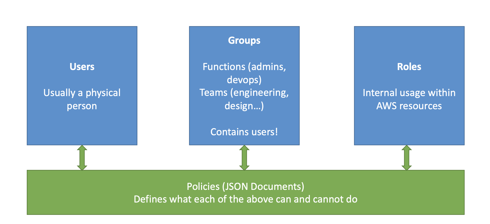
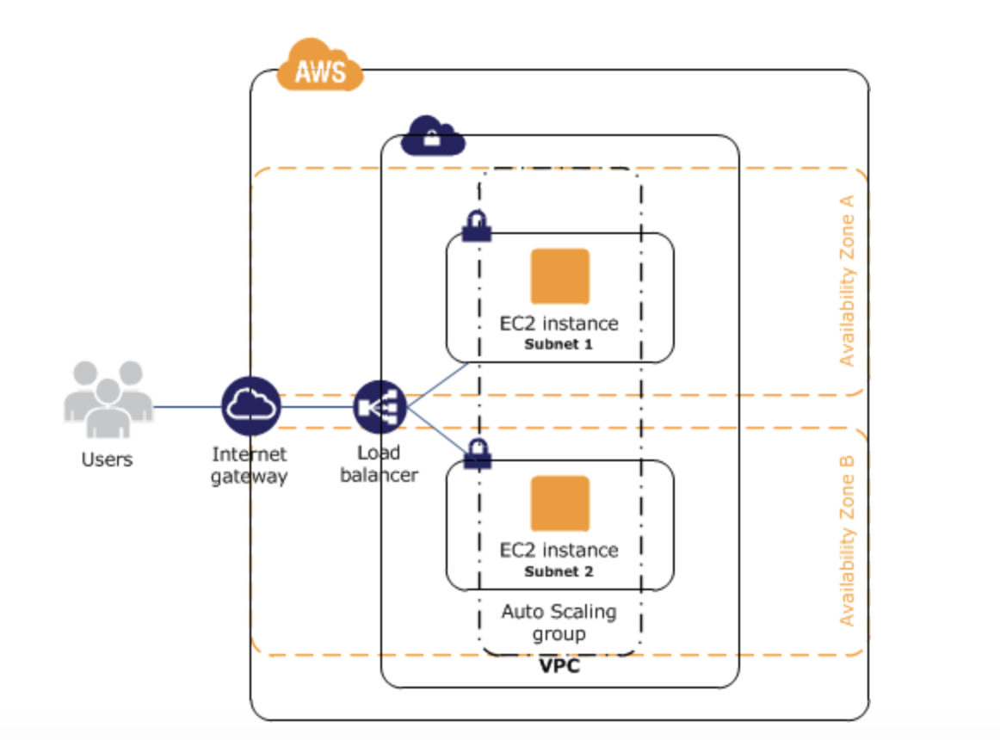
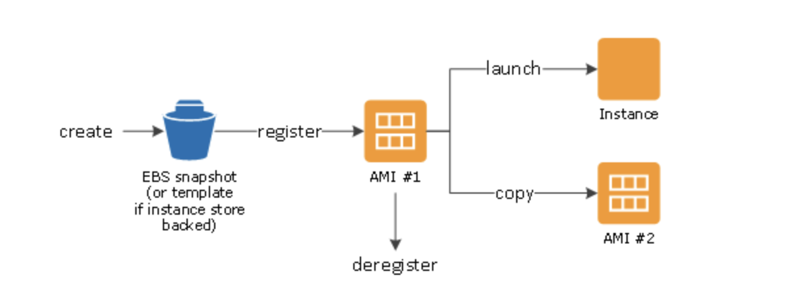
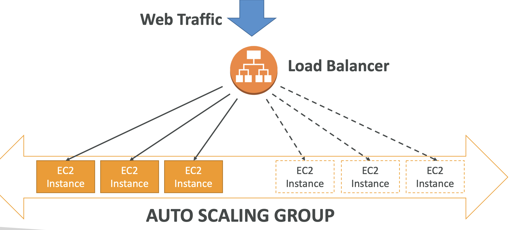
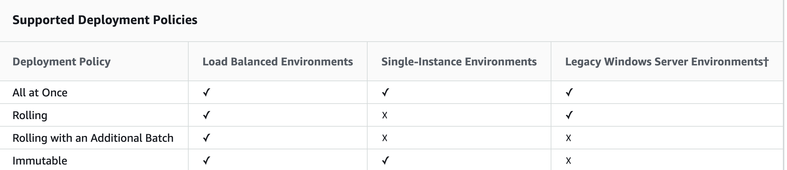

* [Security, Identity, & Compliance](#security)
  * [IAM](#IAM)
  * [Encryption](#encrypt)
  * [RDS](#RDS)

* [EC2](#EC2)
  * [AMI](#AMI)
  * [Zones](#zone)
  * [Instances](#Instances)
  * [ELB](#ELB)
  * [ASG](#ASG)
  * [EBS](#EBS)
  * [Elastic Beanstalk](#EB)

* [ Resources ](#resource)
  * [Buckets](#buck)
  * [Objects](#obj)

* [ Storage](#store)
  * [EBS](#EBS)
  * [RDS](#RDS)

* [ Database](#db)

* [Management & Governance](#mg)

* [Networking & Content Delivery](#ncd)
  * [Route 53](#R53)
  * [EC](#EC)
  * [S3](#S3)

* [DEV TOOLS ](#dev)
  * [ CLI ](#CLI)
  * [ SDK ](#SDK)
  * [ IAM Roles ](#roles)

* [Deploy](#deploy)
* [EBS](#EBS)
* [Deployment Policies](#dp)

# Security

## Best Practices

* Manage access to AWS resources and APIs using identity federation, IAM users, and IAM roles.

* Establish credential management policies and procedures for creating, distributing, rotating, and revoking AWS access credentials.

* Implement the least permissive rules for your security group.

* Regularly patch, update, and secure the operating system and applications on your instance.

## Identity Management & Access (IAM)

### General

* Users
* Groups
* Roles
* IAM has a global view
* Permissions are governed by Policies (JSON)
* MFA (Multi Factor Authentication) can be setup
* IAM has predefined “managed policies”

### Security Groups
#### Overview
* Can be attached to multiple instances
* Locked down to a region / VPC combination
* Does live “outside” the EC2 – if traffic is blocked the EC2 instance won’t see
it
* It’s good to maintain one separate security group for SSH access
* If your application is not accessible (time out), then it’s a security group issue
* If your application gives a “connection refused“ error, then it’s an application
error or it’s not launched
* All inbound traffic is blocked by default
* All outbound traffic is authorized by default

# <u> Compute </u>

## Elastic Compute Cloud (EC2)

### General

* Renting virtual machines (EC2)
* Storing data on virtual drives (EBS)
* Distributing load across machines (ELB)
* Scaling the services using an auto-scaling group (ASG)

Amazon Elastic Compute Cloud (Amazon EC2) provides scalable computing capacity in the Amazon Web Services (AWS) cloud

### Features

* Instances
  * Virtual computing environments

* Amazon Machine Images (AMIs)
  * Preconfigured templates for your instance

* Instance types
Various configurations of CPU, memory, storage, and networking capacity for your instances

* Secure login information for your instances using key pairs

* Instance Store Volumes
  * Storage volumes for temporary data that's deleted when you stop or terminate your instance

* Elastic Block Store (Amazon EBS)
  * Persistent storage volumes for your data using Amazon, known as Amazon EBS volumes

* Regions and Availability Zones
  * Multiple physical locations for your resources, such as instances and Amazon EBS volumes

* A firewall that enables you to specify the protocols, ports, and source IP ranges that can reach your instances using security groups

* Static IPv4 addresses for dynamic cloud computing, known as Elastic IP addresses

* Metadata, known as tags, that you can create and assign to your Amazon EC2 resources

* Virtual networks you can create that are logically isolated from the rest of the AWS cloud, and that you can optionally connect to your own network, known as virtual private clouds (VPCs)

### Amazon Machine Image (AMI)
  * Template that contains a software configuration
  * From an AMI, you launch an instance, which is a copy of the AMI running as a virtual server in the cloud
  * You can launch multiple instances of an AMI

An AMI includes the following:

* One or more EBS snapshots, or, for instance-store-backed AMIs, a template for the root volume of the instance (for example, an operating system, an application server, and applications).

* Launch permissions that control which AWS accounts can use the AMI to launch instances.

* A block device mapping that specifies the volumes to attach to the instance when it's launched.

* After you launch an instance from an AMI, you can connect to it.

####  Lifecycle of AMI

### Instances

* An instance is a virtual server in the cloud
*  Configuration at launch is a copy of the AMI that you specified when you launched the instance
* You can launch different types of instances from a single AMI

#### Starting, Stoping, Terminating
* Stopping an instance  
  *  All of its Amazon EBS volumes remain attached
  * When stopped, you can start the instance again at a later time
  * When stopped, you  can attach or detach Amazon EBS volumes. You can also create an AMI from the instance, and you can change the kernel, RAM disk, and instance type.

* Terminating an Instance
  * The root device volume is deleted by default
  * Any attached Amazon EBS volumes are preserved by default
  *  The instance itself is also deleted, and you can't start the instance again at a later time.

### Elastic Load Balancer

Load balancers are servers that forward internet traffic to multiple
servers (EC2 Instances) downstream

##### Why Use a Load Balancer
* Spread load across multiple downstream instances
* Expose a single point of access (DNS) to your application
* Seamlessly handle failures of downstream instances
* Do regular health checks to your instances
* Provide SSL termination (HTTPS) for your websites
* Enforce stickiness with cookies
* High availability across zones
* Separate public traffic from private traffic

#### ELB Features
* AWS guarantees that it will be working
* AWS takes care of upgrades, maintenance, high availability
* AWS provides only a few configuration knobs

#### Health Checks

Health Checks are crucial for Load Balancers
* They enable the load balancer to know if instances it forwards traffic to
are available to reply to requests
* The health check is done on a port and a route (/health is common)
* If the response is not 200 (OK), then the instance is unhealthy

#### Application Load Balancers
#### Network Load Balancers

### Auto Scaling Groups

### Regions Availability, and Local Zones

Amazon EC2 resources are one of the following: global, tied to a Region, an Availability Zone, or a Local Zone.

#### Regions
* When you launch an instance, you must select an AMI that's in the same Region.
* If the AMI is in another Region, you can copy the AMI to the Region you're using.

#### Availability Zones
An Availability Zone is represented by a Region code followed by a letter identifier; for example, us-east-1a.

To coordinate Availability Zones across accounts, you must use the AZ ID, which is a unique and consistent identifier for an Availability Zone. For example, use1-az1 is an AZ ID for the us-east-1 Region and it has the same location in every AWS account

#### Local Zones
A Local Zone is represented by a Region code followed by an identifier that indicates the location, for example, us-west-2-lax-1a.

Launch any of the following resources in the Local Zone:

* Amazon Virtual Private Cloud subnet
* Amazon EC2 instances
* Amazon EBS volumes
* Amazon FSx file servers
* Application Load Balancer

# Storage

## Best Practices

* Understand the implications of the root device type for data persistence

* Use separate Amazon EBS volumes for the operating system versus your data.

* Ensure that the volume with your data persists after instance termination.
 replication factor that ensures fault tolerance.

* Encrypt EBS volumes and snapshots.

* Deploy critical components of your application across multiple Availability Zones, and replicate your data appropriately.

# Deploy

### Deployment Policies

